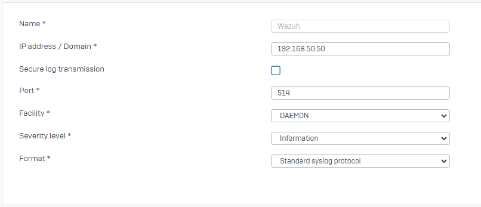

# Create a SOC with Wazuh and Sophos Firewall
Rules and decoders for Wazuh to process the syslog from Sophos firewalls. You can find a reference document from Sophos [here](https://docs.sophos.com/nsg/sophos-firewall/20.0/pdf/sf-syslog-guide-20.0.pdf).

> [!CAUTION]
> Right now, consider this as a proof of concept. Both rules and decoders are NOT production ready!

## Sophos Firewall settings
You need to pass the syslogs to Wazuh without encryption (but there are workarounds with rsyslog afaik). We use the "Standard syslog protocol" here as the legacy format will be removed in a later Sophos Firewall OS update. The port could be adjusted but I'll stay on the standard port 514. 


Check the syslog categories you want to forward to Wazuh.

## Wazuh settings
Wazuh needs to be configured to accept logs. I assume you are running Wazuh in a Docker container (my tests are running in Docker / single node setup), you need something like this in config/wazuh_cluster/wazuh_manager.conf

```
<remote>
    <connection>syslog</connection>
    <port>514</port>
    <protocol>udp</protocol>
    <allowed-ips>INSERT_SOPHOS_FW_IP/24<allowed-ips>
</remote>
```

In the same file, change both logall and logall_json to yes. Start your Docker containers and change some settings in the manager container. You can get into the container with the following command (you need to be in the directory with the docker-compose configuration files):

`docker-compose exec wazuh.manager bash`

In the file `/etc/filebeat/filebeat.yml`, change archives: -> enabled: to true

> [!WARNING]
> I haven't checked yet if this file change survives updates.

## Completed rules
- [x] Basic firewall events (traffic allowed / denied) are fine
- [x] Rules for ATP (Advanced Threat Protection) should be done, but need testing
- [X] Authentication events have according rules, but they are very basic right now (only passing the message from the FW)
- [X] DDNS events only pass the message, but that should be fine
- [X] Mail events (SMTP(S), IMAP(S))
- [X] Gateway event messages
- [X] High availability
- [X] Heartbeats
- [X] Interface
- [X] IPS
- [ ] Sandstorm
- [ ] SD-WAN
- [ ] SSL-Inspection
- [ ] SSL-VPN
- [ ] WAF
- [ ] Web (System HTTPS Deny events)
- [ ] Web content policy / web filter
- [ ] Wireless

The document from Sophos isn't clear in every aspect, some rules may be wrong, they need testing. For example, heartbeats are only described for the old syslog format.
